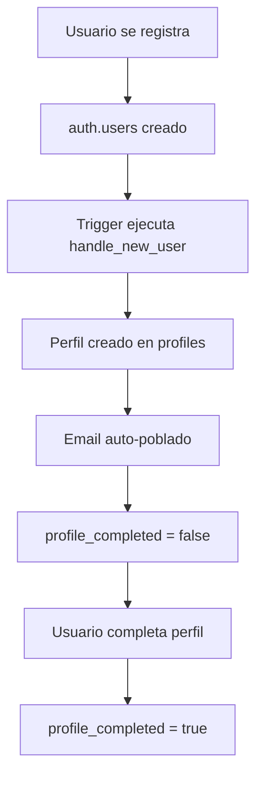
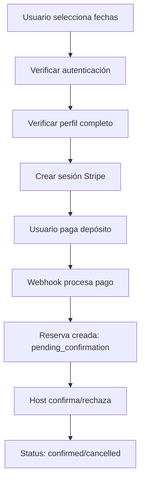
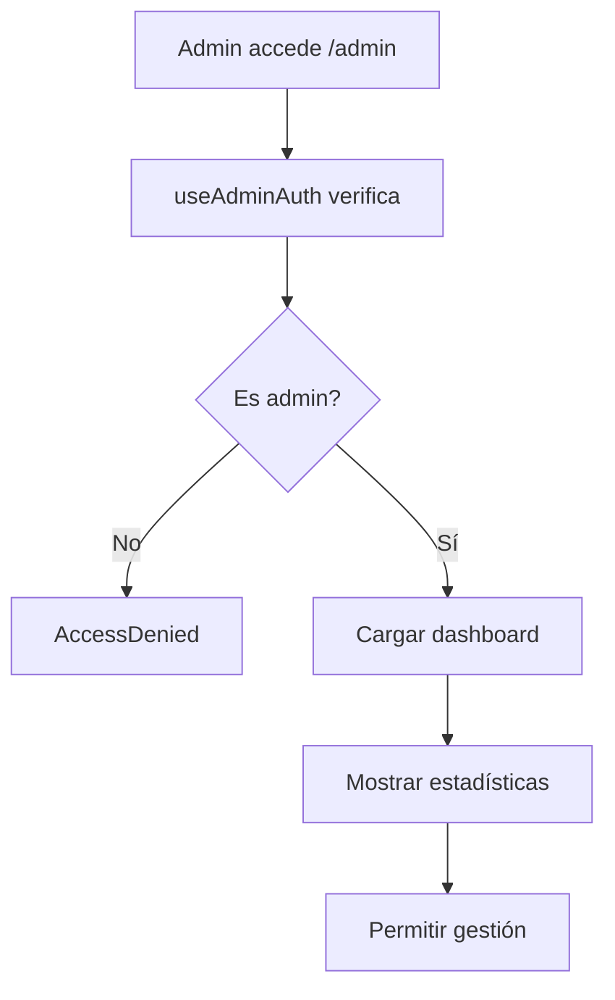

# 📊 GomeraWay - Sistema de Base de Datos y Arquitectura

## 🗄️ **REFERENCIA COMPLETA DE LA BASE DE DATOS**

---

## **1. TABLAS PRINCIPALES**

### **📋 Tabla: `profiles`**
**Propósito:** Gestión completa de perfiles de usuario con datos personales y roles

```sql
CREATE TABLE profiles (
  id UUID PRIMARY KEY,                 -- Referencia a auth.users(id)
  full_name TEXT,                      -- Nombre completo del usuario
  avatar_url TEXT,                     -- URL del avatar
  is_host BOOLEAN DEFAULT FALSE,       -- Indica si es anfitrión
  email TEXT,                          -- Email (auto-poblado desde auth.users)
  phone TEXT,                          -- Teléfono de contacto
  address TEXT,                        -- Dirección completa
  city TEXT,                           -- Ciudad
  country TEXT,                        -- País
  date_of_birth DATE,                  -- Fecha de nacimiento (validación +18)
  profile_completed BOOLEAN DEFAULT FALSE, -- Estado de completitud del perfil
  updated_at TIMESTAMP DEFAULT NOW(),  -- Control de actualizaciones
  role TEXT DEFAULT 'user'             -- Sistema de roles: 'user', 'admin'
);
```

**Índices Activos:**
- `profiles_pkey` - Primary key en id (UUID)
- `idx_profiles_email` - Búsqueda por email
- `idx_profiles_phone` - Búsqueda por teléfono  
- `idx_profiles_profile_completed` - Filtrar perfiles completos
- `idx_profiles_role` - Filtrar por rol

### **📋 Tabla: `listings`**
**Propósito:** Gestión de anuncios de alojamientos y vehículos

```sql
CREATE TABLE listings (
  id BIGINT PRIMARY KEY,               -- ID secuencial auto-incrementable
  host_id UUID REFERENCES profiles(id), -- ID del anfitrión
  title TEXT NOT NULL,                 -- Título del anuncio
  description TEXT,                    -- Descripción detallada
  location TEXT,                       -- Ubicación del anuncio
  price_per_night_or_day NUMERIC NOT NULL, -- Precio por noche/día
  type listing_type NOT NULL,          -- ENUM: 'accommodation', 'vehicle'
  images_urls TEXT[],                  -- Array de URLs de imágenes
  is_active BOOLEAN DEFAULT FALSE,     -- Estado activo/inactivo
  created_at TIMESTAMP DEFAULT NOW()   -- Fecha de creación
);

-- Enum para tipos de anuncio
CREATE TYPE listing_type AS ENUM ('accommodation', 'vehicle');
```

### **📋 Tabla: `listing_details_accommodation`**
**Propósito:** Detalles específicos para alojamientos

```sql
CREATE TABLE listing_details_accommodation (
  listing_id BIGINT PRIMARY KEY REFERENCES listings(id), -- Relación 1:1 con listings
  guests INTEGER,                      -- Número de huéspedes
  bedrooms INTEGER,                    -- Número de habitaciones
  bathrooms INTEGER,                   -- Número de baños
  features TEXT[]                      -- Array de características/amenidades
);
```

### **📋 Tabla: `listing_details_vehicle`**
**Propósito:** Detalles específicos para vehículos

```sql
CREATE TABLE listing_details_vehicle (
  listing_id BIGINT PRIMARY KEY REFERENCES listings(id), -- Relación 1:1 con listings
  fuel TEXT,                           -- Tipo de combustible
  transmission TEXT,                   -- Tipo de transmisión
  seats INTEGER                        -- Número de asientos
);
```

### **📋 Tabla: `bookings`**
**Propósito:** Gestión de reservas con estados y pagos

```sql
CREATE TABLE bookings (
  id BIGINT PRIMARY KEY,               -- ID secuencial auto-incrementable
  listing_id BIGINT REFERENCES listings(id), -- Anuncio reservado
  user_id UUID REFERENCES profiles(id), -- Usuario que hace la reserva
  start_date DATE NOT NULL,            -- Fecha de inicio
  end_date DATE NOT NULL,              -- Fecha de fin
  total_price NUMERIC NOT NULL,        -- Precio total de la reserva
  deposit_paid BOOLEAN DEFAULT FALSE,  -- Estado del depósito
  status booking_status NOT NULL,      -- Estado de la reserva
  created_at TIMESTAMP DEFAULT NOW()   -- Fecha de creación
);

-- Enum para estados de reserva
CREATE TYPE booking_status AS ENUM (
  'pending_confirmation',              -- Esperando confirmación del host
  'confirmed',                         -- Confirmada por el host
  'cancelled'                          -- Cancelada/rechazada
);
```

### **📋 Tabla: `subscriptions`**
**Propósito:** Gestión de membresías y límites de anuncios

```sql
CREATE TABLE subscriptions (
  id BIGINT PRIMARY KEY,               -- ID secuencial auto-incrementable
  user_id UUID UNIQUE REFERENCES profiles(id), -- Usuario suscrito (único)
  plan subscription_plan NOT NULL,     -- Plan de suscripción
  status subscription_status NOT NULL, -- Estado de la suscripción
  stripe_subscription_id TEXT UNIQUE,  -- ID de suscripción en Stripe
  stripe_customer_id TEXT,             -- ID de cliente en Stripe
  created_at TIMESTAMP DEFAULT NOW(),  -- Fecha de creación
  updated_at TIMESTAMP DEFAULT NOW()   -- Fecha de actualización
);

-- Enums para planes y estados
CREATE TYPE subscription_plan AS ENUM ('básico', 'premium', 'diamante');
CREATE TYPE subscription_status AS ENUM ('active', 'inactive', 'cancelled');
```

**Límites por Plan:**
- **Básico**: 1 anuncio
- **Premium**: 5 anuncios  
- **Diamante**: Ilimitado

---

## **2. FUNCIONES Y TRIGGERS AUTOMÁTICOS**

### **🔄 Función de Verificación de Admin**
```sql
-- Función auxiliar para verificar admin sin recursión
CREATE OR REPLACE FUNCTION is_admin_user(user_id UUID)
RETURNS BOOLEAN
LANGUAGE SQL
SECURITY DEFINER
STABLE
AS $$
    SELECT EXISTS (
        SELECT 1 
        FROM profiles 
        WHERE id = user_id 
        AND role = 'admin'
    );
$$;
```

### **🔄 Auto-Creación de Perfiles**
```sql
-- Función ejecutada automáticamente al registrarse
CREATE OR REPLACE FUNCTION handle_new_user() 
RETURNS TRIGGER 
LANGUAGE PLPGSQL
SECURITY DEFINER
AS $$
BEGIN
  INSERT INTO public.profiles (id, email, full_name, role, profile_completed)
  VALUES (
    NEW.id, 
    NEW.email,
    COALESCE(NEW.raw_user_meta_data->>'full_name', NEW.raw_user_meta_data->>'name'),
    'user',
    FALSE
  );
  RETURN NEW;
END;
$$;

-- Trigger en auth.users
CREATE TRIGGER on_auth_user_created
  AFTER INSERT ON auth.users
  FOR EACH ROW EXECUTE FUNCTION handle_new_user();
```

### **🔄 Actualización de Timestamps**
```sql
-- Función para actualizar updated_at automáticamente
CREATE OR REPLACE FUNCTION update_profiles_updated_at()
RETURNS TRIGGER 
LANGUAGE PLPGSQL
SECURITY INVOKER
AS $$
BEGIN
    NEW.updated_at = NOW();
    RETURN NEW;
END;
$$;

CREATE OR REPLACE FUNCTION update_subscriptions_updated_at()
RETURNS TRIGGER 
LANGUAGE PLPGSQL
SECURITY INVOKER
AS $$
BEGIN
    NEW.updated_at = NOW();
    RETURN NEW;
END;
$$;

-- Triggers activos
CREATE TRIGGER update_profiles_updated_at_trigger
    BEFORE UPDATE ON profiles
    FOR EACH ROW EXECUTE FUNCTION update_profiles_updated_at();

CREATE TRIGGER update_subscriptions_updated_at_trigger
    BEFORE UPDATE ON subscriptions
    FOR EACH ROW EXECUTE FUNCTION update_subscriptions_updated_at();
```

---

## **3. POLÍTICAS DE SEGURIDAD (RLS)**

### **🛡️ Tabla `profiles` - Políticas sin Recursión**
```sql
-- SOLUCIÓN ACTUALIZADA - SIN RECURSIÓN INFINITA

-- 1. Usuarios pueden ver/editar su propio perfil
CREATE POLICY "profiles_own_access" ON profiles
    FOR ALL 
    USING (auth.uid() = id)
    WITH CHECK (auth.uid() = id);

-- 2. Service role acceso completo (para operaciones del sistema)
CREATE POLICY "profiles_service_access" ON profiles
    FOR ALL 
    USING (auth.role() = 'service_role')
    WITH CHECK (auth.role() = 'service_role');

-- 3. Admins pueden ver todos los perfiles (usando función auxiliar)
CREATE POLICY "profiles_admin_select" ON profiles
    FOR SELECT 
    USING (is_admin_user(auth.uid()));

-- 4. Admins pueden modificar todos los perfiles
CREATE POLICY "profiles_admin_all" ON profiles
    FOR UPDATE 
    USING (is_admin_user(auth.uid()))
    WITH CHECK (is_admin_user(auth.uid()));

-- 5. Admins pueden insertar perfiles
CREATE POLICY "profiles_admin_insert" ON profiles
    FOR INSERT
    WITH CHECK (is_admin_user(auth.uid()));

-- 6. Admins pueden eliminar perfiles
CREATE POLICY "profiles_admin_delete" ON profiles
    FOR DELETE
    USING (is_admin_user(auth.uid()));
```

### **🛡️ Tabla `subscriptions`**
```sql
-- Usuarios pueden ver sus propias suscripciones
CREATE POLICY "Users can view their own subscriptions" ON subscriptions
    FOR SELECT USING (auth.uid() = user_id);

-- Usuarios pueden actualizar sus propias suscripciones
CREATE POLICY "Users can update their own subscriptions" ON subscriptions
    FOR UPDATE USING (auth.uid() = user_id);

-- Admins pueden ver todas las suscripciones
CREATE POLICY "Admin can view all subscriptions" ON subscriptions
    FOR SELECT USING (
        EXISTS (
            SELECT 1 FROM profiles
            WHERE profiles.id = auth.uid() 
            AND profiles.role = 'admin'
        )
    );

-- Admins pueden actualizar todas las suscripciones
CREATE POLICY "Admin can update all subscriptions" ON subscriptions
    FOR UPDATE USING (
        EXISTS (
            SELECT 1 FROM profiles
            WHERE profiles.id = auth.uid() 
            AND profiles.role = 'admin'
        )
    );

-- Admins pueden insertar suscripciones
CREATE POLICY "Admin can insert subscriptions" ON subscriptions
    FOR INSERT WITH CHECK (
        EXISTS (
            SELECT 1 FROM profiles
            WHERE profiles.id = auth.uid() 
            AND profiles.role = 'admin'
        )
    );

-- Admins pueden eliminar suscripciones
CREATE POLICY "Admin can delete subscriptions" ON subscriptions
    FOR DELETE USING (
        EXISTS (
            SELECT 1 FROM profiles
            WHERE profiles.id = auth.uid() 
            AND profiles.role = 'admin'
        )
    );

-- Service role acceso completo
CREATE POLICY "Service role can manage all subscriptions" ON subscriptions
    FOR ALL USING (auth.role() = 'service_role');
```

---

## **4. RELACIONES ENTRE TABLAS**

### **🔗 Foreign Keys Activos**
```sql
-- bookings → listings
ALTER TABLE bookings ADD CONSTRAINT bookings_listing_id_fkey 
    FOREIGN KEY (listing_id) REFERENCES listings(id);

-- bookings → profiles  
ALTER TABLE bookings ADD CONSTRAINT bookings_user_id_fkey 
    FOREIGN KEY (user_id) REFERENCES profiles(id);

-- listing_details_accommodation → listings
ALTER TABLE listing_details_accommodation ADD CONSTRAINT listing_details_accommodation_listing_id_fkey 
    FOREIGN KEY (listing_id) REFERENCES listings(id);

-- listing_details_vehicle → listings
ALTER TABLE listing_details_vehicle ADD CONSTRAINT listing_details_vehicle_listing_id_fkey 
    FOREIGN KEY (listing_id) REFERENCES listings(id);

-- listings → profiles
ALTER TABLE listings ADD CONSTRAINT listings_host_id_fkey 
    FOREIGN KEY (host_id) REFERENCES profiles(id);

-- subscriptions → profiles
ALTER TABLE subscriptions ADD CONSTRAINT subscriptions_user_id_fkey 
    FOREIGN KEY (user_id) REFERENCES profiles(id);
```

---

## **5. SISTEMA DE ROLES Y PERMISOS**

### **👤 Roles Disponibles:**
- **`user`** → Usuario básico sin suscripción (default)
- **`admin`** → Acceso completo al panel administrativo

### **🔐 Flujo de Permisos:**
1. **Registro** → Auto-asignación rol `user`
2. **Promoción Manual** → Admin asigna rol `admin`

### **🎯 Verificación de Roles en Frontend:**
```typescript
// Hook principal para autenticación de admin
const { user, isAdmin, loading, error } = useAdminAuth();

// Hook simple para verificar admin
const { isAdmin, loading } = useIsAdmin();

// Hook con redirect automático si no es admin
const { user, isAdmin, loading, error } = useRequireAdmin('/');
```

---

## **6. FUNCIONES EDGE (SUPABASE)**

### **🔧 `/functions/stripe-webhook`**
**Propósito:** Procesar eventos de Stripe y crear reservas

**Estados de Reserva:**
- `pending_confirmation` → Esperando aprobación del host
- `confirmed` → Reserva confirmada por el host  
- `cancelled` → Reserva cancelada/rechazada

### **🔧 `/functions/check-listing-limits`**
**Propósito:** Verificar límites de anuncios según suscripción

**Lógica de Límites:**
```typescript
const PLAN_LIMITS = {
  'básico': 1,
  'premium': 5,
  'diamante': -1, // unlimited
} as const;
```

### **🔧 `/functions/create-booking-checkout`**
**Propósito:** Crear sesiones de pago en Stripe para reservas

---

## **7. PANEL DE ADMINISTRACIÓN**

### **📊 AdminDashboard**
**Ruta:** `/admin`
**Componentes:**
- Estadísticas en tiempo real
- Gráficos de usuarios/reservas/suscripciones
- Métricas de ingresos estimados

### **📊 SubscriptionsManager**  
**Ruta:** `/admin/subscriptions`
**Funcionalidades:**
- Ver todas las suscripciones activas
- Cambiar planes de usuarios
- Pausar/activar suscripciones
- Búsqueda y filtros avanzados

### **📊 UsersManager**
**Ruta:** `/admin/users`  
**Funcionalidades:**
- Gestión completa de usuarios
- Promoción/degradación de roles
- Vista detallada de perfiles

### **🔐 Acceso Protegido:**
```typescript
// Verificación automática en rutas admin
const { user, isAdmin, loading, error } = useAdminAuth();

if (loading) return <LoadingSpinner />;
if (!user || !isAdmin) return <AccessDenied />;
```

---

## **8. FLUJOS DE DATOS PRINCIPALES**

### **🔄 Flujo de Registro y Perfil:**


### **🔄 Flujo de Reservas:**


### **🔄 Flujo de Administración:**


---

## **9. COMANDOS SQL DE MANTENIMIENTO**

### **🔧 Verificar Estado del Sistema:**
```sql
-- Ver todas las tablas del sistema
SELECT table_name, table_type 
FROM information_schema.tables 
WHERE table_schema = 'public'
ORDER BY table_name;

-- Ver políticas RLS activas
SELECT tablename, policyname, cmd, permissive
FROM pg_policies 
WHERE schemaname = 'public'
ORDER BY tablename, policyname;

-- Ver funciones personalizadas
SELECT routine_name, routine_type, security_type
FROM information_schema.routines 
WHERE routine_schema = 'public'
ORDER BY routine_name;
```

### **🔧 Gestión de Usuarios:**
```sql
-- Promover usuario a admin
UPDATE profiles SET role = 'admin' 
WHERE email = 'admin@example.com';

-- Ver todos los admins activos
SELECT id, full_name, email, role, profile_completed
FROM profiles 
WHERE role = 'admin'
ORDER BY updated_at DESC;

-- Estadísticas de usuarios por rol
SELECT 
  role,
  COUNT(*) as total_users,
  COUNT(CASE WHEN profile_completed THEN 1 END) as completed_profiles,
  ROUND(COUNT(CASE WHEN profile_completed THEN 1 END) * 100.0 / COUNT(*), 2) as completion_rate
FROM profiles 
GROUP BY role
ORDER BY total_users DESC;
```

### **🔧 Gestión de Suscripciones:**
```sql
-- Ver distribución de suscripciones
SELECT plan, status, COUNT(*) as total
FROM subscriptions 
GROUP BY plan, status
ORDER BY plan, status;

-- Ver usuarios con suscripciones activas
SELECT 
  p.full_name,
  p.email,
  s.plan,
  s.status,
  s.created_at as subscribed_at
FROM profiles p
JOIN subscriptions s ON p.id = s.user_id
WHERE s.status = 'active'
ORDER BY s.created_at DESC;

-- Verificar límites de anuncios
SELECT 
  p.full_name,
  p.email,
  s.plan,
  COUNT(l.id) as active_listings,
  CASE 
    WHEN s.plan = 'básico' THEN 1
    WHEN s.plan = 'premium' THEN 5
    WHEN s.plan = 'diamante' THEN -1
    ELSE 0
  END as plan_limit
FROM profiles p
LEFT JOIN subscriptions s ON p.id = s.user_id AND s.status = 'active'
LEFT JOIN listings l ON p.id = l.host_id AND l.is_active = true
GROUP BY p.id, p.full_name, p.email, s.plan
HAVING COUNT(l.id) > 0
ORDER BY COUNT(l.id) DESC;
```

---

## **10. SOLUCIÓN DE PROBLEMAS COMUNES**

### **❌ Error: "infinite recursion detected in policy"**
**Causa:** Políticas RLS que se referencian a sí mismas
**✅ Solución:** Implementada función `is_admin_user()` con `SECURITY DEFINER`

### **❌ Error: "Profile not created automatically"**
**Causa:** Trigger `handle_new_user` inactivo
**Verificación:**
```sql
SELECT trigger_name, event_object_table, action_timing
FROM information_schema.triggers 
WHERE trigger_name = 'on_auth_user_created';
```

### **❌ Error: "Admin access denied"**
**Causa:** Usuario no tiene rol admin asignado
**Solución:**
```sql
-- Verificar rol actual
SELECT email, role FROM profiles WHERE email = 'tu-email@ejemplo.com';

-- Asignar rol admin
UPDATE profiles SET role = 'admin' WHERE email = 'tu-email@ejemplo.com';
```

### **❌ Error: "Subscription limits not working"**
**Causa:** Función edge `check-listing-limits` no configurada
**Verificación:** Revisar logs en Supabase Dashboard → Edge Functions

---

## **11. CONFIGURACIÓN DE ENTORNO**

### **🔧 Variables de Entorno Requeridas:**
```env
VITE_SUPABASE_URL=https://xygzonaacfmvcjyiikas.supabase.co
VITE_SUPABASE_ANON_KEY=your-anon-key-here
VITE_STRIPE_PUBLISHABLE_KEY=pk_test_...
```

### **🔧 URLs del Sistema:**
- **Frontend:** `http://localhost:8083`
- **Admin Panel:** `http://localhost:8083/admin`
- **Supabase Dashboard:** `https://supabase.com/dashboard/project/xygzonaacfmvcjyiikas`

---

## **12. ESTADO ACTUAL Y PRÓXIMOS PASOS**

### **✅ Funcionalidades Implementadas:**
- ✅ Sistema de autenticación completo
- ✅ Perfiles de usuario con campos extendidos
- ✅ Gestión de suscripciones con límites
- ✅ Panel de administración funcional
- ✅ Políticas RLS sin recursión
- ✅ Triggers automáticos operativos
- ✅ Funciones de verificación de admin

### **🚀 Próximas Mejoras:**
- [ ] Gestión de Anuncios en admin (`/admin/listings`)
- [ ] Gestión completa de Reservas (`/admin/bookings`)
- [ ] Analytics avanzados con gráficos
- [ ] Sistema de notificaciones
- [ ] Verificación de identidad de usuarios
- [ ] Reportes financieros automatizados

### **🔧 Optimizaciones Técnicas Pendientes:**
- [ ] Caché Redis para consultas frecuentes
- [ ] Compresión automática de imágenes
- [ ] Backup automático programado
- [ ] Logs centralizados y alertas
- [ ] Tests automatizados de RLS policies

---

**📊 Estado del Sistema:** ✅ **Completamente Operativo**  
**🔐 Seguridad:** ✅ **RLS Policies Implementadas y Verificadas**  
**👨‍💻 Panel Admin:** ✅ **Funcional con Gestión de Usuarios y Suscripciones**  
**📅 Última Actualización:** Octubre 2025  
**🔄 Próxima Revisión:** Implementación de gestión de anuncios en admin