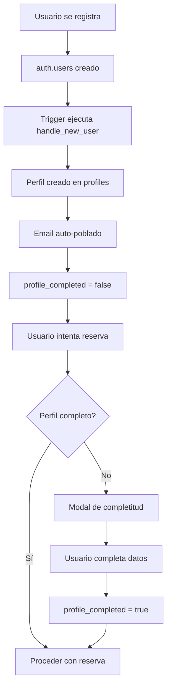
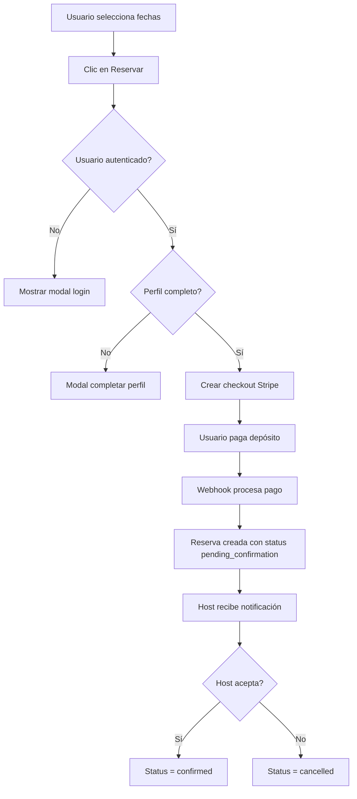
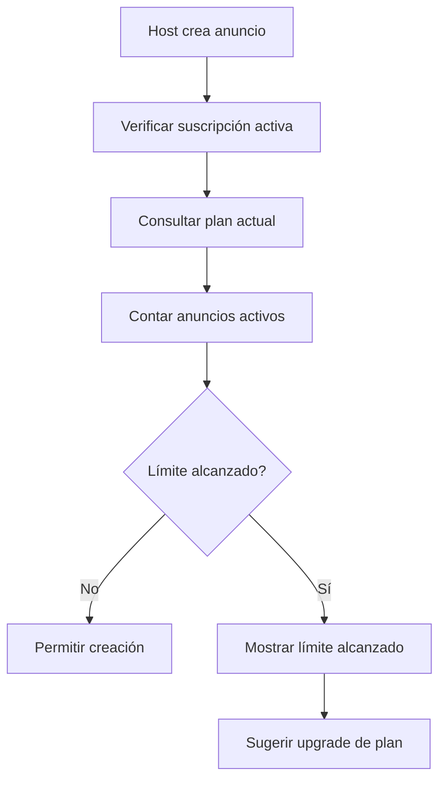

# 📊 GomeraWay - Sistema de Base de Datos y Arquitectura

## 🗄️ **REFERENCIA COMPLETA DE LA BASE DE DATOS**

---

## **1. TABLAS PRINCIPALES**

### **📋 Tabla: `profiles`**
**Propósito:** Gestión completa de perfiles de usuario con datos personales y roles

```sql
CREATE TABLE profiles (
  id UUID REFERENCES auth.users(id) PRIMARY KEY,
  full_name TEXT,
  avatar_url TEXT,
  is_host BOOLEAN DEFAULT FALSE,
  email TEXT,                           -- ✅ Auto-poblado desde auth.users
  phone TEXT,                           -- ✅ Teléfono de contacto
  address TEXT,                         -- ✅ Dirección completa
  city TEXT,                           -- ✅ Ciudad
  country TEXT,                        -- ✅ País
  date_of_birth DATE,                  -- ✅ Fecha nacimiento (validación +18)
  profile_completed BOOLEAN DEFAULT FALSE, -- ✅ Estado de completitud
  updated_at TIMESTAMP DEFAULT NOW(),  -- ✅ Control de actualizaciones
  role TEXT DEFAULT 'user' CHECK (role IN ('user', 'host', 'admin')) -- ✅ Sistema de roles
);
```

**Índices Activos:**
- `idx_profiles_email` - Búsqueda por email
- `idx_profiles_phone` - Búsqueda por teléfono
- `idx_profiles_profile_completed` - Filtrar perfiles completos
- `idx_profiles_role` - Filtrar por rol

### **📋 Tabla: `listings`**
**Propósito:** Gestión de anuncios de alojamientos y vehículos

```sql
-- Estructura actual (simplificada)
CREATE TABLE listings (
  id SERIAL PRIMARY KEY,
  host_id UUID REFERENCES profiles(id),
  title TEXT NOT NULL,
  description TEXT,
  type TEXT CHECK (type IN ('accommodation', 'vehicle')),
  location TEXT,
  price_per_night_or_day DECIMAL(10,2),
  is_active BOOLEAN DEFAULT TRUE,
  images_urls TEXT[],
  created_at TIMESTAMP DEFAULT NOW(),
  updated_at TIMESTAMP DEFAULT NOW()
);
```

### **📋 Tabla: `bookings`**
**Propósito:** Gestión de reservas con estados y pagos

```sql
-- Estructura actual
CREATE TABLE bookings (
  id SERIAL PRIMARY KEY,
  listing_id INTEGER REFERENCES listings(id),
  user_id UUID REFERENCES profiles(id),
  start_date DATE NOT NULL,
  end_date DATE NOT NULL,
  total_price DECIMAL(10,2),
  deposit_paid BOOLEAN DEFAULT FALSE,
  status booking_status DEFAULT 'pending_confirmation',
  stripe_session_id TEXT,
  created_at TIMESTAMP DEFAULT NOW(),
  updated_at TIMESTAMP DEFAULT NOW()
);

-- Enum de estados
CREATE TYPE booking_status AS ENUM (
  'pending_confirmation',
  'confirmed', 
  'cancelled'
);
```

### **📋 Tabla: `subscriptions`**
**Propósito:** Gestión de membresías y límites de anuncios

```sql
CREATE TABLE subscriptions (
  id SERIAL PRIMARY KEY,
  user_id UUID REFERENCES profiles(id),
  plan TEXT NOT NULL,
  status TEXT DEFAULT 'active',
  stripe_subscription_id TEXT,
  created_at TIMESTAMP DEFAULT NOW(),
  updated_at TIMESTAMP DEFAULT NOW()
);
```

**Límites por Plan:**
- **Básico**: 1 anuncio
- **Premium**: 5 anuncios  
- **Diamante**: Ilimitado

### **📋 Tabla: `admin_actions`**
**Propósito:** Auditoría de acciones administrativas

```sql
CREATE TABLE admin_actions (
  id SERIAL PRIMARY KEY,
  admin_id UUID REFERENCES profiles(id),
  action_type TEXT NOT NULL,
  target_type TEXT NOT NULL,
  target_id TEXT NOT NULL,
  details JSONB,
  created_at TIMESTAMP DEFAULT NOW()
);
```

---

## **2. TRIGGERS Y FUNCIONES AUTOMÁTICAS**

### **🔄 Auto-Creación de Perfiles**
```sql
-- Función ejecutada automáticamente al registrarse
CREATE OR REPLACE FUNCTION handle_new_user() 
RETURNS TRIGGER AS $$
BEGIN
  INSERT INTO public.profiles (id, email, full_name, role, profile_completed)
  VALUES (
    NEW.id, 
    NEW.email,
    COALESCE(NEW.raw_user_meta_data->>'full_name', NEW.raw_user_meta_data->>'name'),
    'user',
    FALSE
  );
  RETURN NEW;
END;
$$

-- Trigger en auth.users
CREATE TRIGGER on_auth_user_created
  AFTER INSERT ON auth.users
  FOR EACH ROW EXECUTE FUNCTION handle_new_user();
```

### **🔄 Actualización de Timestamps**
```sql
-- Función para actualizar updated_at
CREATE OR REPLACE FUNCTION update_profiles_updated_at()
RETURNS TRIGGER AS $$
BEGIN
    NEW.updated_at = NOW();
    RETURN NEW;
END;
$$

-- Triggers activos
CREATE TRIGGER update_profiles_updated_at_trigger
    BEFORE UPDATE ON profiles
    FOR EACH ROW EXECUTE FUNCTION update_profiles_updated_at();

CREATE TRIGGER update_subscriptions_updated_at
    BEFORE UPDATE ON subscriptions
    FOR EACH ROW EXECUTE FUNCTION update_updated_at_column();
```

---

## **3. POLÍTICAS DE SEGURIDAD (RLS)**

### **🛡️ Tabla `profiles`**
```sql
-- Usuarios pueden ver/editar su propio perfil
"Enable read access for users based on user_id"
  FOR SELECT USING (auth.uid() = id);

"Enable update for users based on user_id" 
  FOR UPDATE USING (auth.uid() = id);

-- Administradores acceso completo
"Enable admin read access to all profiles"
  FOR SELECT USING (
    EXISTS (
      SELECT 1 FROM profiles admin_profile 
      WHERE admin_profile.id = auth.uid() 
      AND admin_profile.role = 'admin'
    )
  );

"Enable admin update access to all profiles"
  FOR UPDATE USING (
    EXISTS (
      SELECT 1 FROM profiles admin_profile 
      WHERE admin_profile.id = auth.uid() 
      AND admin_profile.role = 'admin'
    )
  );

-- Inserción para usuarios autenticados
"Enable insert for authenticated users only"
  FOR INSERT WITH CHECK (auth.role() = 'authenticated');
```

---

## **4. FUNCIONES EDGE (SUPABASE)**

### **🔧 `/functions/stripe-webhook`**
**Propósito:** Procesar pagos de Stripe y crear reservas

**Estados de Reserva:**
- `pending_confirmation` → Esperando aprobación del host
- `confirmed` → Reserva confirmada por el host
- `cancelled` → Reserva cancelada/rechazada

### **🔧 `/functions/check-listing-limits`**
**Propósito:** Verificar límites de anuncios según suscripción

**Lógica de Límites:**
```typescript
const PLAN_LIMITS = {
  'básico': 1,
  'basico': 1,
  'premium': 5,
  'diamante': -1, // unlimited
} as const;
```

### **🔧 `/functions/create-booking-checkout`**
**Propósito:** Crear sesiones de pago en Stripe

---

## **5. SISTEMA DE ROLES Y PERMISOS**

### **👤 Roles Disponibles:**
- **`user`** → Usuario básico sin suscripción
- **`host`** → Usuario con suscripción activa para publicar
- **`admin`** → Acceso completo al panel administrativo

### **🔐 Flujo de Permisos:**
1. **Registro** → Auto-asignación rol `user`
2. **Suscripción** → Promoción a `host` 
3. **Administración** → Promoción manual a `admin`

### **🎯 Verificación de Roles:**
```typescript
// Hook principal
const { user, profile, isAdmin } = useAuth();

// Hook específico admin
const { isAdmin, loading } = useAdminAuth();

// Hook con redirect automático
const { user, isAdmin } = useRequireAdmin('/');
```

---

## **6. FLUJOS DE DATOS PRINCIPALES**

### **🔄 Flujo de Registro y Perfil:**


### **🔄 Flujo de Reservas:**


### **🔄 Flujo de Límites de Anuncios:**


---

## **7. PANEL DE ADMINISTRACIÓN**

### **📊 AdminDashboard**
**Ruta:** `/admin`
**Componentes:**
- Estadísticas en tiempo real
- Gráficos de usuarios/hosts/reservas
- Ingresos mensuales estimados

### **📊 SubscriptionsManager**  
**Ruta:** `/admin/subscriptions`
**Funcionalidades:**
- Ver todas las suscripciones
- Cambiar planes de usuarios
- Pausar/activar suscripciones
- Búsqueda y filtros avanzados

### **🔐 Acceso Protegido:**
```typescript
// Verificación automática
const { user, isAdmin, loading } = useAdminAuth();

// Redirect si no es admin
if (!user || !isAdmin) {
  return <AccessDenied />;
}
```

---

## **8. COMANDOS SQL DE MANTENIMIENTO**

### **🔧 Verificar Estado del Sistema:**
```sql
-- Ver estructura de profiles
SELECT column_name, data_type, is_nullable 
FROM information_schema.columns 
WHERE table_name = 'profiles' 
ORDER BY ordinal_position;

-- Ver triggers activos
SELECT trigger_name, event_object_table, action_statement 
FROM information_schema.triggers 
WHERE event_object_table IN ('profiles', 'users');

-- Ver políticas RLS
SELECT policyname, cmd, qual 
FROM pg_policies 
WHERE tablename = 'profiles';
```

### **🔧 Gestión de Usuarios:**
```sql
-- Promover usuario a admin
UPDATE profiles SET role = 'admin' 
WHERE id = 'user-uuid-here';

-- Ver todos los admins
SELECT id, full_name, email, role 
FROM profiles 
WHERE role = 'admin';

-- Ver estadísticas de usuarios
SELECT 
  role,
  COUNT(*) as total,
  COUNT(CASE WHEN profile_completed THEN 1 END) as completed_profiles
FROM profiles 
GROUP BY role;
```

### **🔧 Gestión de Suscripciones:**
```sql
-- Ver suscripciones por plan
SELECT plan, status, COUNT(*) as total
FROM subscriptions 
GROUP BY plan, status;

-- Ver límites de anuncios por usuario
SELECT 
  p.full_name,
  s.plan,
  COUNT(l.id) as active_listings
FROM profiles p
LEFT JOIN subscriptions s ON p.id = s.user_id
LEFT JOIN listings l ON p.id = l.host_id AND l.is_active = true
WHERE s.status = 'active'
GROUP BY p.id, p.full_name, s.plan;
```

---

## **9. SOLUCIÓN DE PROBLEMAS COMUNES**

### **❌ Error: "infinite recursion detected in policy"**
**Causa:** Políticas RLS recursivas
**Solución:** Ejecutar `fix-rls-policies.sql`

### **❌ Error: "column does not exist"**
**Causa:** Campos faltantes en profiles
**Solución:** Ejecutar `enhanced-profiles-setup.sql`

### **❌ Error: "Profile not created automatically"**
**Causa:** Trigger inactivo
**Verificación:**
```sql
SELECT * FROM information_schema.triggers 
WHERE trigger_name = 'on_auth_user_created';
```

### **❌ Error: "Admin access denied"**
**Causa:** Usuario no tiene rol admin
**Solución:**
```sql
UPDATE profiles SET role = 'admin' 
WHERE email = 'admin@example.com';
```

---

## **10. CONFIGURACIÓN DE ENTORNO**

### **🔧 Variables de Entorno Requeridas:**
```env
VITE_SUPABASE_URL=https://your-project.supabase.co
VITE_SUPABASE_ANON_KEY=your-anon-key
VITE_STRIPE_PUBLISHABLE_KEY=pk_test_...
```

### **🔧 URLs del Sistema:**
- **Frontend:** `http://localhost:8083`
- **Admin Panel:** `http://localhost:8083/admin`
- **Supabase Dashboard:** `https://supabase.com/dashboard`

---

## **11. PRÓXIMAS MEJORAS PLANIFICADAS**

### **🚀 Funcionalidades Pendientes:**
- [ ] Gestión de Anuncios en admin (`/admin/listings`)
- [ ] Analytics avanzados (`/admin/analytics`)
- [ ] Gestión de Usuarios (`/admin/users`)
- [ ] Sistema de notificaciones
- [ ] Verificación de identidad
- [ ] Reportes financieros

### **🔧 Optimizaciones Técnicas:**
- [ ] Caché Redis para estadísticas
- [ ] Compresión de imágenes automática
- [ ] Backup automático de base de datos
- [ ] Logs centralizados

---

**Última Actualización:** Octubre 2025  
**Estado del Sistema:** ✅ Operativo y Funcional  
**Próxima Revisión:** Implementación de funcionalidades admin adicionales