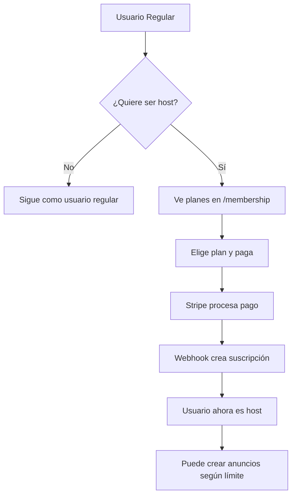
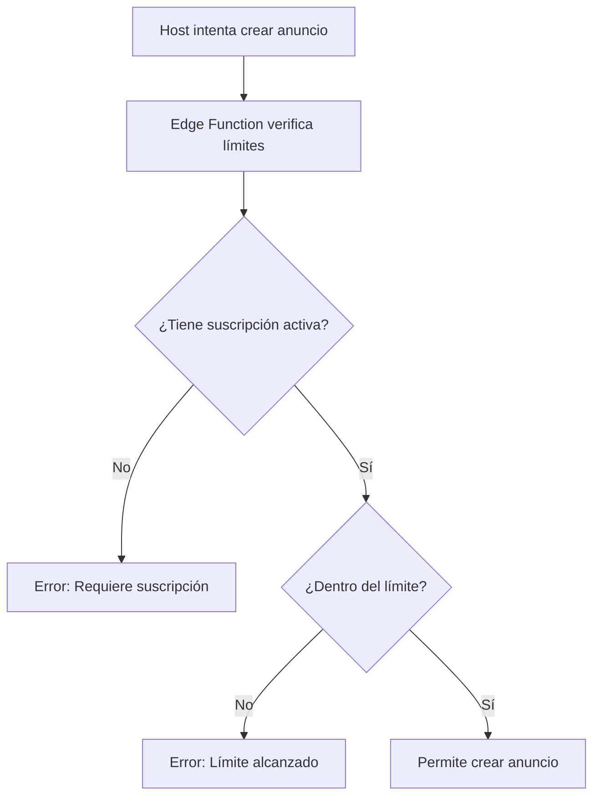

# 💳 Sistema de Suscripciones GomeraWay - Documentación Final

## 🎯 **LÓGICA CORREGIDA Y VERIFICADA**

### **✅ Comportamiento del Sistema:**

#### **👤 Usuario Regular (Sin Suscripción):**
- ❌ **NO** puede crear anuncios
- ✅ **SÍ** puede hacer reservas
- ❌ **NO** tiene registro en tabla `subscriptions`
- 🔄 Ve mensaje: "Se requiere suscripción activa para crear anuncios"
- 💡 Puede suscribirse para convertirse en host

#### **👨‍💼 Host con Suscripción Activa:**
- ✅ **SÍ** puede crear anuncios según límites
- ✅ **SÍ** puede hacer reservas
- ✅ **SÍ** tiene registro activo en `subscriptions`
- 📊 Ve estadísticas de uso y límites

---

## **💰 Planes de Suscripción**

| Plan | Precio | Límite Anuncios | Características |
|------|--------|-----------------|-----------------|
| **Básico** | €9.99/mes | 1 anuncio | 10 fotos, soporte email |
| **Premium** | €19.99/mes | 5 anuncios | 20 fotos, soporte prioritario, promoción |
| **Diamante** | €39.99/mes | ∞ anuncios | 50 fotos, soporte VIP, analytics avanzados |

---

## **🔧 Componentes del Sistema**

### **1. Base de Datos**
```sql
-- Enum limpio (sin duplicados)
CREATE TYPE subscription_plan AS ENUM ('básico', 'premium', 'diamante');
CREATE TYPE subscription_status AS ENUM ('active', 'inactive', 'cancelled');

-- Tabla subscriptions
CREATE TABLE subscriptions (
  id BIGINT PRIMARY KEY,
  user_id UUID UNIQUE REFERENCES profiles(id),
  plan subscription_plan NOT NULL,
  status subscription_status NOT NULL,
  stripe_subscription_id TEXT UNIQUE,
  stripe_customer_id TEXT,
  created_at TIMESTAMP DEFAULT NOW(),
  updated_at TIMESTAMP DEFAULT NOW()
);
```

### **2. Edge Functions**

#### **`check-listing-limits`**
```typescript
// Plan limits configuration
const PLAN_LIMITS = {
  'básico': 1,
  'premium': 5,
  'diamante': -1, // unlimited
} as const;

// Logic: No subscription = canCreate: false
if (!subscription || subscription.status !== 'active') {
  return {
    canCreate: false,
    planName: 'none',
    message: 'Se requiere una suscripción activa para crear anuncios'
  };
}
```

#### **`create-checkout-session`**
```typescript
// Stripe Product IDs
const PLAN_PRICE_IDS = {
  'básico': 'prod_SrhgM76Jw1lKcn',
  'premium': 'prod_SrhhsvazdNDKRG', 
  'diamante': 'prod_Srhhbxz0I6mEs5'
};
```

#### **`stripe-webhook`**
```typescript
// Plan name normalization
const planName = session.metadata?.plan_name || 'Básico';
const plan = planName.toLowerCase() === 'básico' ? 'básico' : 
             planName.toLowerCase() === 'premium' ? 'premium' : 
             planName.toLowerCase() === 'diamante' ? 'diamante' :
             'básico'; // fallback
```

### **3. Frontend Components**

#### **`SubscriptionManagement.tsx`**
- **Sin suscripción:** Muestra "Sin Suscripción" con 0 límite
- **Con suscripción:** Muestra plan actual y estadísticas de uso
- **Upgrade/downgrade:** Disponible según plan actual

#### **`SubscriptionUpgrade.tsx`**
- **Planes en español:** `básico`, `premium`, `diamante`
- **Product IDs reales:** Integración directa con Stripe
- **Lógica de upgrade/downgrade:** Maneja cambios de plan correctamente

#### **`LimitIndicator.tsx`**
- **Sin suscripción:** No se muestra (usuario no puede crear anuncios)
- **Con suscripción:** Muestra progreso y límites según plan
- **Alertas:** Avisa cuando se acerca al límite

---

## **🔄 Flujos de Proceso**

### **Flujo de Suscripción:**


### **Flujo de Creación de Anuncios:**


---

## **📊 Verificación del Sistema**

### **Scripts de Test:**
- `test-subscription-logic-final.sql` - Verifica lógica completa
- `fix-enum-duplication.sql` - Limpia duplicados de enum

### **Casos de Prueba:**
1. ✅ Usuario sin suscripción no puede crear anuncios
2. ✅ Host básico limitado a 1 anuncio
3. ✅ Host premium limitado a 5 anuncios  
4. ✅ Host diamante sin límites
5. ✅ Upgrade/downgrade funciona correctamente
6. ✅ Stripe webhook maneja todos los planes

---

## **🛠️ Comandos de Mantenimiento**

### **Verificar Estado:**
```sql
-- Ver suscripciones activas
SELECT p.email, s.plan, s.status, s.created_at
FROM subscriptions s
JOIN profiles p ON s.user_id = p.id
WHERE s.status = 'active'
ORDER BY s.created_at DESC;

-- Contar usuarios por categoría
SELECT 
  COUNT(CASE WHEN s.user_id IS NOT NULL THEN 1 END) as paying_hosts,
  COUNT(CASE WHEN s.user_id IS NULL THEN 1 END) as regular_users
FROM profiles p
LEFT JOIN subscriptions s ON p.id = s.user_id AND s.status = 'active';
```

### **Gestión de Planes:**
```sql
-- Cambiar plan de usuario
UPDATE subscriptions 
SET plan = 'premium', updated_at = NOW()
WHERE user_id = 'user-uuid-here';

-- Cancelar suscripción
UPDATE subscriptions 
SET status = 'cancelled', updated_at = NOW()
WHERE user_id = 'user-uuid-here';
```

---

## **📈 Métricas de Negocio**

### **KPIs Importantes:**
- **Conversion Rate:** Usuarios → Hosts pagando
- **ARPU:** Average Revenue Per User (hosts)
- **Churn Rate:** Cancelaciones de suscripciones
- **Plan Distribution:** Distribución entre básico/premium/diamante

### **Consultas de Analytics:**
```sql
-- Distribución de planes
SELECT plan, COUNT(*) as users, 
       ROUND(COUNT(*) * 100.0 / SUM(COUNT(*)) OVER(), 2) as percentage
FROM subscriptions WHERE status = 'active'
GROUP BY plan;

-- Ingresos estimados mensuales
SELECT 
  SUM(CASE WHEN plan = 'básico' THEN 9.99
           WHEN plan = 'premium' THEN 19.99  
           WHEN plan = 'diamante' THEN 39.99
           ELSE 0 END) as monthly_revenue
FROM subscriptions WHERE status = 'active';
```

---

## **🎯 Estado Final**

### **✅ SISTEMA COMPLETAMENTE FUNCIONAL:**
- ✅ Lógica sin defaults automáticos
- ✅ Solo hosts pagando pueden crear anuncios
- ✅ Límites por plan aplicados correctamente
- ✅ Stripe integration con Product IDs reales
- ✅ Frontend maneja todos los casos de uso
- ✅ Admin panel puede gestionar suscripciones
- ✅ Base de datos limpia y optimizada

**El sistema de suscripciones está listo para producción y escalabilidad.**